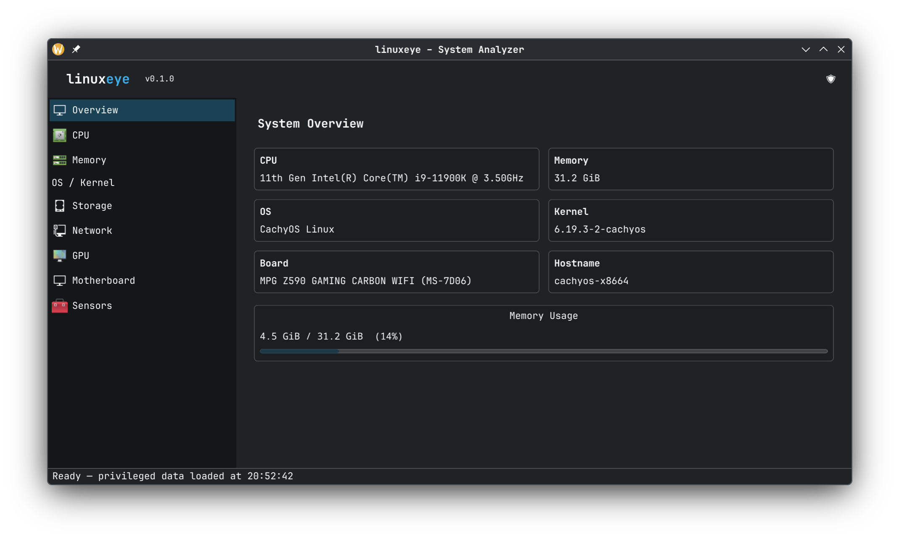

# linuxeye

> **Simple Linux-native system analysis and hardware diagnostics platform**  
> Inspired by AIDA64 – built for Linux, by Linux users.

[](LICENSE)
[]()
[]()

---

## Preview



---

## Overview

**linuxeye** is a modular, open-source system analysis tool for Linux that gives you deep insight into your hardware, kernel, firmware, and software layers — all within a clean, modern interface.

It is **not** just another system monitor. linuxeye is a **system observation platform** that reads, understands, and reports on the full internal structure of your machine.

---

## Features

| Module | Data Collected |
|---|---|
| **CPU** | Model, cores/threads, frequency, cache, flags, CPUID, Virtualization (VT-x / AMD-V, KVM status) |
| **Memory** | Total/used/free RAM, swap, memory map |
| **OS / Kernel** | Distro, kernel version, uptime, hostname, init system |
| **Storage** | Disks, partitions, filesystems, mount points |
| **Network** | Interfaces |
| **GPU** | DRM/KMS info, VRAM |
| **Motherboard** | DMI/SMBIOS – board, BIOS, chassis info |
| **Sensors** | hwmon |

---

## Requirements

- Linux kernel ≥ 5.x
- Qt6 ≥ 6.2
- CMake ≥ 3.20
- GCC ≥ 11 or Clang ≥ 13

### Install dependencies (Ubuntu/Debian)

```bash
sudo apt install qt6-base-dev qt6-svg-dev cmake g++ ninja-build git
```

### Install dependencies (Arch Linux)

```bash
sudo pacman -S qt6-base qt6-svg cmake gcc ninja git
```

---

## Building

```bash
git clone https://github.com/mustafaby11/linuxeye.git
cd linuxeye
mkdir build && cd build
cmake .. -DCMAKE_BUILD_TYPE=Release
make -j$(nproc)
./linuxeye
```

---

## Tested Linux distributions:
- CachyOS
- Pardus GNU/Linux 25 (bilge)

---

## License

GNU General Public License v3.0 – see [LICENSE](LICENSE) for details.

---

## Author

Created by **[mustafaby11](https://github.com/mustafaby11)**.
